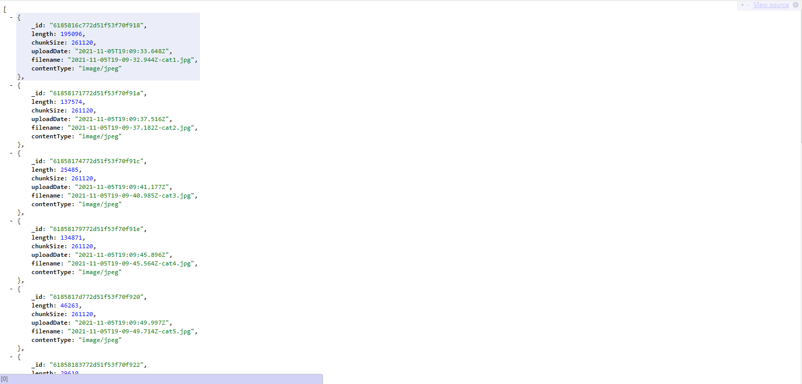
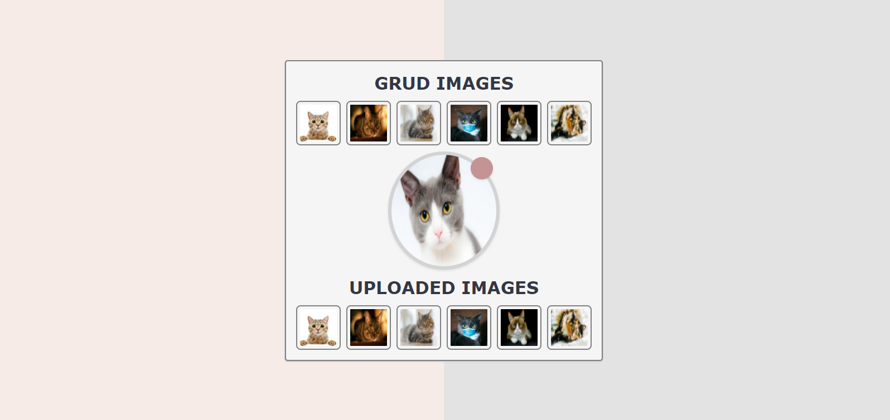

# HAITI PROJECT

`This app is an image uploader. It allows front-end users to download images with jpg and png extension from their computers and store it in a MongoDB database. An API has also been created to get all uploaded images`.

# HOW TO PARTICIPATE IN THIS PROJECT

## You need to clone the repersitory first

```
git clone https://github.com/juniorthx3/react-uploader-images.git
```

## From react-upload-images, install the dependency

```
npm install
```

## Acess to the directory rest-api-photos and install the dependency

```
cd rest-api-photos
npm install
```

## Access also to the directory uploader and install the dependency

```
cd uploader
npm install
```

## Publication of changes in the project

To publish local changes and upload them to github, use the following command in the root directory
```
git push
```

# PROJECT OVERVIEW

## BACK END VIEW


## FRONT END VIEW
